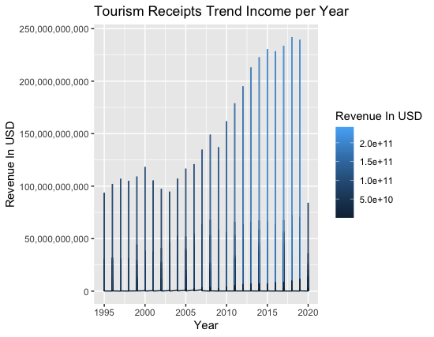
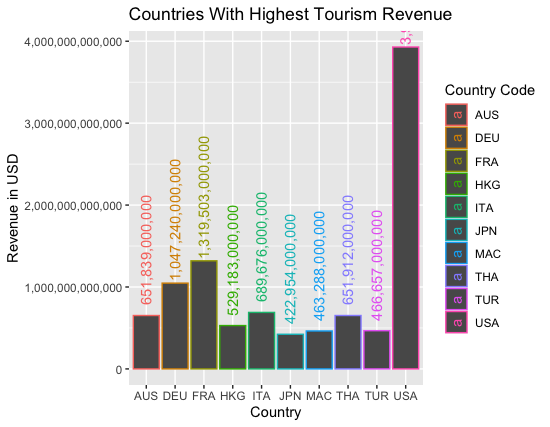
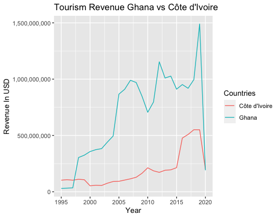
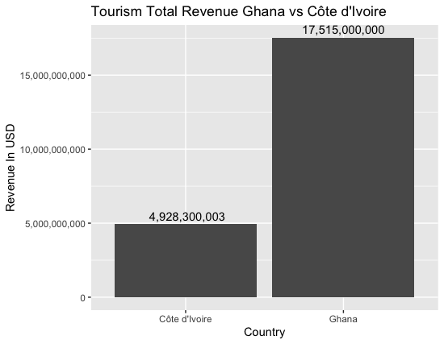

# Overview

In this project, I am making an data analysis of the data tourism recipts dataset. this analysis enables the viewer to better understand how much tourism industry, in all its form, has been doing over the years. It gives an insight of when and which country is more likely to give back a good return to a potential investment in this sector.

The dataset was downloaded from Kaggle website. It is the World Bank tourism revenue report from 1995-2020 for more than 100 countries across the world.

[Learning R](https://youtu.be/gfl4D6psC9U)

# Data Analysis Results

## How have international tourism receipts changed over time?

In this part of the analysis we are trying how much the tourism industry made every year globally.

We can see that the global revenue was law during the 1990s but registered some growth over the years till 2000. It went down again from 2000 to 2005 before it start growing exponentially till 2019. This global growth should be the consequence of a peaceful and economically growing world for the most part. However, the drastic fall in the receipts in 2020 is certainly due COVID 19 that locked down all countries and affected ridiculeously this industry.

## Which countries have the highest tourism receipts?

We will display and analyse the top 10 total revenue by country.

The United States is on top of the total tourism receipts years cumulate with almost 4 trillion USD. It is followed by France, Germany, Italy, Thailand, and Australia respectively. France and Germany made more than 1 trillion USD, with France being the second highest in revenue. Italy, Thailand, and Australia are over the 6 hundred billion USD. Then, Japan, Hong Kong, Macao, Turkey made over 4 hundred billion USD.
Beside the United States, We can say that most of the global tourism receipts comes from Western Europe, Then followed by Asia.

# Ghana vs Ivory Coast Tourism Revenue

Ghana and Cote d'Ivoire (Ivory Coast) are two countries in West Africa that have been registering important economic growth over the past ten years in the region. The tourism industry played an important role in Ghana economy while Cote d'Ivoire (Ivory Coast), which is an mainly an agricultural economy based, has registered some important progress in that sector as part of the diversification of its economy. Through this analysis we will understand which one of these countries is doing better in this sector.

As we can see in these charts above, Ghana made a lot more than Cote d'Ivoire in tourism from 1995-2020. Cote d'Ivoire revenue started growing a lot more from 2016 to 2019 before COVID. However, Ghana revenue during that same period of time was going down before increasing drastically in 2019, where it reaches its peak of about 1.5 billion USD.
At that point, Ghana tourism sector made more 17.5 billion dollars while Its neighbor Ivory Coast made about 5 billion in total receipts.
Though, Ghana appears to be well in ahead of Cote d'Ivoire in this analysis, due to the growth rate we can see from the first chart, we can say that those two countries have a great potential in this industry after the COVID era is over. Potential investment in the tourism sector of those countries will be fruitful.

# Development Environment

* RStudio (tool)

* R (programming language)
* Tidyverse (library)
* readr (library)
* scales (library)

# Useful Websites

* [LinkedIn Learning (Learning R)](https://www.linkedin.com/learning/learning-r-18748884)
* [w3schools](https://www.w3schools.com/r/default.asp)
*[Kaggle](https://www.kaggle.com/datasets/abdulhamitcelik/international-tourism-receipts)

# Future Work

* Analyse deeper the data to understand growth by region.
* Find other data related to tourism receipts that will enable us to understand related factors to those numbers.